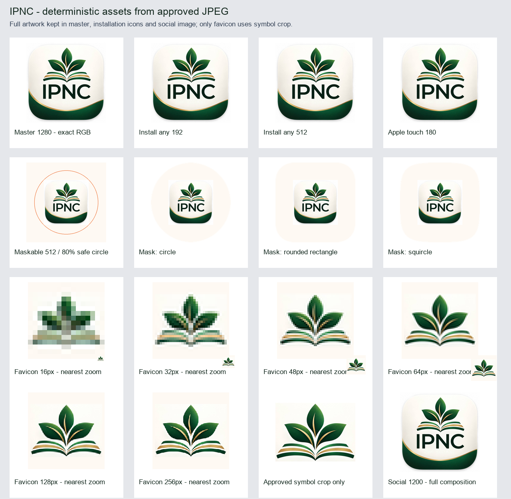

# Identidade oficial IPNC — entrega de 05/10/2026

A arte enviada pelo proprietário substitui o broto RENOVO/ipnc em todos os consumidores encontrados. Nenhuma tela ativa encontrada continua utilizando a logo antiga. A busca cobriu imports, imagens públicas, URLs, SVG, CSS, instalação, metadados e geração de PDFs; 55 verificações de viewport complementaram o inventário.

## Fonte e fidelidade

- Referência oficial indicada: [Canva](https://www.canva.com/d/cLSR_4p0xFc86Oi). O conector foi consultado, sem editar o design; retornou miniatura de 446 × 447 px e não ofereceu exportação original. Essa miniatura não foi usada.
- Fonte efetivamente usada: o JPEG **1280 × 1280 px** reenviado pelo proprietário, que perguntou “Essa não serve?”. A decisão de usá-lo foi comunicada antes da implementação. Original preservado em [source-approved-original.jpg](source-approved-original.jpg), SHA256 `458eecf06c3e2e50c34eadfbd67c9bf841b3404e9b81b67172c320fdcde3c309`.
- Master interno: `src/assets/logo-ipnc.png`, RGB, **1280 × 1280 px**, 555.210 bytes, SHA256 `569a6b3d502689ef244592e2a376c77840e6692d8e54f1ff3b3dd6389d4ddd1b`.
- Comparação automatizada: todos os pixels RGB decodificados são idênticos ao JPEG; perfil ICC original preservado. Nenhum desenho, captura, upscale, correção de cor, recorte ou remoção de fundo no master. PNG com compressão sem perda. Converter JPEG para PNG não recupera detalhes já perdidos na compressão do original.
- Fundo branco/creme, sombra, símbolo, IPNC e faixa decorativa permanecem integrados à arte. O fundo existente dos componentes foi preservado.

[Metadados completos](asset-metadata.json) · [Verificação dos derivados](asset-verification.json) · [Inventário anterior](inventory-before.md) · [Verificação final](verification-final.json).

## Assets publicados

| Arquivo | Dimensões / finalidade |
|---|---|
| `src/assets/logo-ipnc.png` | 1280 × 1280; substituído, caminho central preservado |
| `public/icons/icon-192x192-v2.png` | 192 × 192; instalação, arte completa |
| `public/icons/icon-512x512-v2.png` | 512 × 512; instalação, arte completa |
| `public/icons/icon-maskable-512x512-v2.png` | 512 × 512; composição própria, opaca |
| `public/icons/apple-touch-icon-v2.png` | 180 × 180; Apple, arte completa |
| `public/icons/favicon-32x32-v2.png` | 32 × 32; símbolo institucional |
| `public/icons/ipnc-social-v2.png` | 1200 × 1200; compartilhamento, arte completa |
| `public/favicon.ico` | substituído; quadros 16, 32, 48, 64, 128 e 256 px |
| `public/icons/icon-192x192.png` | substituído pela cópia do novo 192, compatibilidade |
| `public/icons/icon-512x512.png` | substituído pela cópia do novo 512, compatibilidade |
| `public/icons/icon-maskable-512x512.png` | substituído pela cópia do novo maskable, compatibilidade |

Todos os tamanhos partem do master, com redução LANCZOS. O favicon usa a exceção solicitada: recorte somente das folhas/livro, coordenadas `(258,69,1041,646)`, sem redesenho. O nome IPNC seria ilegível a 16/32 px; a logo principal e os demais derivados continuam completos.

O maskable coloca a arte completa em 288 × 288 px, centrada em `(112,112)` no canvas 512. O fundo adicional usa creme `#fef9f3`, amostrado da própria arte. Até os cantos da composição ficam dentro do círculo seguro de raio 204,8 px: distância máxima 203,647 px. Círculo, rounded square e squircle foram conferidos; nenhum elemento importante é cortado. O arquivo é diferente do ícone normal.

## Locais de uso encontrados

Os 16 imports anteriores continuam no caminho central. Foi acrescentado o import institucional nos dois pontos de marca da tesouraria, totalizando 17 arquivos:

| Consumidor | Superfície |
|---|---|
| `src/pages/Auth.tsx` | entrada/login |
| `src/pages/ResetPassword.tsx` | recuperação de acesso |
| `src/components/layout/AppSidebar.tsx` | diretoria desktop |
| `src/components/layout/MobileHeader.tsx` | diretoria mobile |
| `src/components/layout/TabletNavigationRail.tsx` | diretoria tablet |
| `src/components/pastor/PastorLayout.tsx` | carregamento pastoral |
| `src/components/pastor/PastorSidebar.tsx` | pastor desktop/tablet |
| `src/components/pastor/PastorMobileHeader.tsx` | pastor mobile |
| `src/pages/PastorSociedade.tsx` | carregamento de sociedade pastoral |
| `src/components/secretaria/SecretariaNavigation.tsx` | Secretaria EBD, sidebar/rail |
| `src/pages/PortalIgreja.tsx` | boas-vindas, retorno, identificação e sidebar |
| `src/pages/EleicaoApresentar.tsx` | apresentação da eleição |
| `src/components/membro/MembroLayout.tsx` | layout legado, atualmente sem rota ativa |
| `src/components/PWAInstallPrompt.tsx` | diálogo global de instalação |
| `src/utils/generateCalendarPDF.ts` | cronograma pastoral |
| `src/utils/generateEbdPDF.ts` | PDFs de chamada, período e trimestre |
| `src/components/treasury/TreasuryDashboard.tsx` | marca no sidebar e cabeçalho mobile |

`PainelPastor` recebe a marca pelo layout. Secretaria e demais áreas recebem o diálogo de instalação global. Relatórios financeiros atuais não incorporavam imagem institucional; anexos de comprovantes não são logos e não foram modificados. A foto de fundo de broto não é a logo. Mockups/capturas históricas permaneceram como evidências datadas, fora do runtime. O nome do produto “Renovo IPNC”, textos do diálogo e tema anual RENOVO foram preservados conforme o escopo; isso não representa uso do bitmap antigo.

Pequenos ajustes: `object-fit:contain` na Secretaria e no loading de sociedade, impedir redução do container da marca no sidebar pastoral e encaixar imagens nos slots existentes da tesouraria. Sem redesign, mudanças de fluxo, Supabase, migrations, autenticação, PINs, permissões ou regras de negócio.

## PWA e cache

- Manifest aponta **exclusivamente** para os três ícones `-v2.png`. `id`, `start_url`, `scope`, `display` e `orientation` foram preservados.
- URLs versionadas para Apple, favicon PNG e imagem social; ICO recebe `?v=ipnc-v2`; manifest recebe `?v=ipnc-v2` no HTML.
- Worker e registrador sincronizados em `ump-cache-v10`, registro `/sw.js?v=2026-10-05-logo-v2`; precache usa somente os ícones novos. Ativação remove caches antigos da aplicação e preserva caches alheios. API, autenticação e navegação continuam fora da interceptação.
- Imports internos continuam recebendo nome com hash de conteúdo no build Vite.
- Os três endereços antigos têm bytes da arte nova para compatibilidade com clientes que ainda solicitem o manifesto anterior.
- Open Graph/Twitter usam URL absoluta da imagem oficial 1200 quadrada; cartão Twitter `summary` conserva a composição quadrada.

O manifesto e o worker garantem os novos endereços no site. O launcher de um aplicativo já instalado e caches de plataformas sociais têm atualização própria, não controlada pelo service worker. Não foi executada reinstalação no aparelho do proprietário nem prometida atualização instantânea de todos os launchers.

## Validação e evidências

Node 24.19.0, npm e lockfile existente. Verificações:

- `npx tsc -p tsconfig.app.json --noEmit`: passou.
- `node --experimental-strip-types --test tests/pwa-install.test.mjs`: **12/12 passaram**.
- `node --experimental-strip-types --test tests/*.mjs tests/*.ts`: **224/224 passaram**.
- `npm run build`: passou. Avisos de chunk grande e import estático/dinâmico de Sonner já existiam.
- Lint dos arquivos JS/TS alterados: **0 erros; 2 avisos anteriores** de React Refresh na fixture. Python validado por compilação e execução dos pipelines. A dívida global de lint registrada antes da troca era 278 erros/55 avisos; não foi declarada como corrigida.
- `git diff --check`: passou.
- Reprodução determinística dos assets, igualdade de todos os pixels do master, ICC, dimensões, quadros ICO e geometria maskable: passou.
- Conferência em **320, 390, 768, 1024 e 1440 px**, 11 superfícies/55 verificações: todas as imagens carregadas, nenhum overflow horizontal. [Medições](evidence/viewport-checks.json). Elementos ocultos nos breakpoints existentes continuam ocultos.
- Busca final por hashes das quatro imagens antigas em `src`, `public` e `dist/client`: **nenhuma correspondência**. Busca textual final confirmou os 17 imports e apenas endereços versionados em HTML/manifest/precache.

Evidências principais: [login mobile](evidence/auth-390.png), [login desktop](evidence/auth-1440.png), [cabeçalho mobile](evidence/diretoria-320.png), [rail tablet](evidence/diretoria-768.png), [sidebar desktop](evidence/diretoria-1440.png), [Secretaria](evidence/secretaria-1440.png), [pastor](evidence/pastor-1440.png), [loading](evidence/pastor-loading-390.png), [portal](evidence/portal-1440.png), [tesouraria mobile](evidence/tesouraria-390.png), [instalação](evidence/install-390.png), [eleição](evidence/eleicao-390.png).

PDFs reais com dados fictícios: quatro geradores, oito páginas renderizadas e inspecionadas. Master incorporado com todos os pixels RGB idênticos, proporção 1:1 e tamanho 20 mm EBD/22 mm calendário. Numeração e bloqueio de snapshots obsoletos preservados. [Inspeção técnica](evidence/pdf-inspection.json) e [inspeção visual](evidence/pdf-visual-inspection.json). [Chamada](evidence/chamada-ebd-20261004-1.png), [período](evidence/relatorio-chamadas-ebd-1.png), [trimestral](evidence/relatorio-trimestral-ebd-1.png), [cronograma](evidence/cronograma-ipnc---dados-ficticios-outubro-2026-1.png).

Problema anterior observado, fora da troca de marca: emoji de troféu com glifos inválidos no ranking do PDF de chamada (`generateEbdPDF.ts`, linha252). Registrado na inspeção, sem alterar o gerador nesta tarefa. PDFs usam a compressão existente e têm aproximadamente 4,9 MB; cabeçalho institucional somente na primeira página, comportamento preservado.

## Reproduzir e conferir manualmente

1. Executar `python3 scripts/generate-brand-assets.py --source docs/branding/2026-10-05/source-approved-original.jpg --output /tmp/ipnc-brand-reproduction`. Requer Pillow; não altera o checkout.
2. Executar `node scripts/verify-brand-pdfs.mjs . 569a6b3d502689ef244592e2a376c77840e6692d8e54f1ff3b3dd6389d4ddd1b /tmp/ipnc-brand-pdf-qa`. Somente dados fictícios; rede bloqueada no processo.
3. Executar `python3 scripts/verify-brand-pdfs.py --output /tmp/ipnc-brand-pdf-qa --poppler /caminho/para/pdftoppm`. Requer Pillow, pypdf e Poppler; compara pixels, proporção, numeração e renderiza páginas.
4. No site publicado, abrir entrada e instalação; conferir a arte completa. Em sessões autorizadas, verificar cabeçalhos mobile, sidebar desktop, rail tablet, Secretaria e pastor nas cinco larguras. Não lançar valores, votos ou presenças reais durante a conferência.
5. Conferir `/manifest.json`, ícones `-v2`, Apple, favicon e metadados; confirmar que carregam a identidade nova. Prévia de plataformas sociais e launcher instalado dependem dos próprios clientes.

Entrega usa a `main`, GitHub e o projeto Sites existente `appgprj_6a9808f7510c819190f1e078cac5fb8c`, preservando acesso. A revisão, versão e confirmação terminal do deploy são informadas na resposta de entrega.
