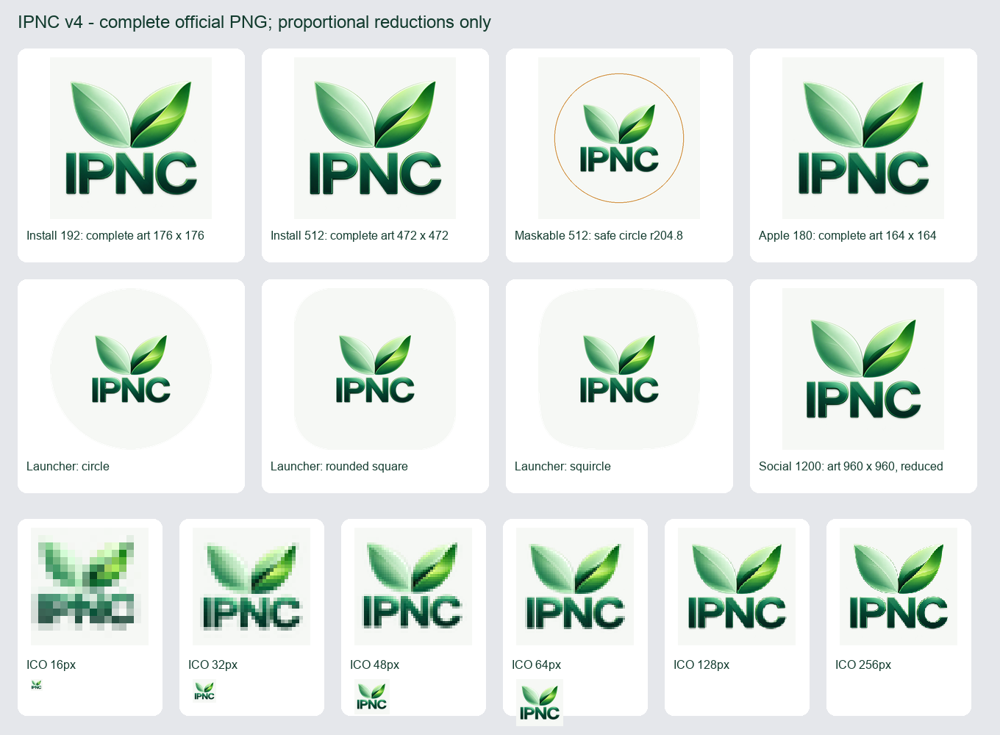

# Logo IPNC oficial fornecida pelo proprietário — v4

O proprietário enviou `Logotipo IPNC com Folhas Verdes (1).png` e pediu aplicar essa arte em todo o aplicativo e no PWA. Esta é a fonte vigente: duas folhas coloridas e IPNC verde, com fundo transparente. A entrega v3 e a fonte Canva anterior permanecem documentadas como histórico; elas não são a origem desta nova arte.

## Fonte exata

- Arquivo recebido: `/Users/octavioribeiroleite/Downloads/Logotipo IPNC com Folhas Verdes (1).png`.
- Fonte preservada: `official-source.png`, nesta pasta.
- PNG RGBA, **1254 × 1254 px**, **991.280 bytes**, alpha de 0 a 255.
- SHA256: `2df611f147250f6df0caeb189051cea1cd0748c05ed90bb752501125021f7081`.
- Bounding box de pixels alpha do original: `(0,4,1238,1254)`.
- `src/assets/logo-ipnc.png` e `src/assets/logo-ipnc-entry.png` são cópias **byte por byte** do arquivo recebido.

Nenhuma mudança de cor, desenho, elemento, proporção, recorte de conteúdo ou canvas, nitidez ou ampliação foi aplicada. Os pixels periféricos e as margens transparentes da fonte permanecem. Não houve edição no Canva nem geração de imagem. O caminho central existente foi preservado para que os consumidores recebam a nova arte.

## Derivados

Os arquivos públicos foram produzidos diretamente do PNG original. O canvas inteiro é reduzido proporcionalmente por LANCZOS e composto sobre **#f6f8f5**, um fundo claro compatível com a arte verde. Esse fundo pertence aos derivados para instalação/favicons/previews; os dois masters internos continuam transparentes.

| Arquivo público | Canvas | Canvas da arte inserida | Posição |
|---|---|---|---|
| `public/icons/icon-192x192-v4.png` | 192 × 192 | 176 × 176 | (8,8) |
| `public/icons/icon-512x512-v4.png` | 512 × 512 | 472 × 472 | (20,20) |
| `public/icons/icon-maskable-512x512-v4.png` | 512 × 512 | 280 × 280 | (116,116) |
| `public/icons/apple-touch-icon-v4.png` | 180 × 180 | 164 × 164 | (8,8) |
| `public/icons/favicon-32x32-v4.png` | 32 × 32 | 30 × 30 | (1,1) |
| `public/icons/ipnc-social-v4.png` | 1200 × 1200 | 960 × 960 | (120,120) |
| `public/favicon.ico` | 16, 32, 48, 64, 128 e 256 px | redução direta em cada quadro | centralizada |

Os PNGs têm codificação sem perda. Os quadros ICO são verificados pixel por pixel após abrir o arquivo; o quadro 32 px coincide com o favicon PNG 32 px. A arte completa é mantida também no favicon. Não é substituída por um novo desenho de símbolo; em 16 px, a leitura do texto fica naturalmente limitada pelo tamanho.

O script explícita e automaticamente limita a escala a no máximo 1. Todos os derivados desta fonte são reduções. Nenhum asset de produção é ampliado artificialmente.

## Maskable e área segura

O maskable é uma composição própria, distinta do ícone normal: a arte inteira reduzida para 280 × 280 px é centralizada no canvas 512 × 512. Após redução, o bounding box alpha fica em `(123,146,390,394)`. A distância máxima dos cantos desse bounding box até o centro `(256,256)` é **192,354 px**, abaixo do raio seguro de **204,8 px** (40% do canvas), com margem de **12,446 px**.

A verificação adicional percorre o centro de cada pixel com alpha maior que zero. O raio máximo efetivamente ocupado é **172,570 px**, dando margem de **32,230 px**. A margem menor de 12,446 px acima é a medida conservadora dos cantos do retângulo delimitador.

Todos os pixels alpha da camada de arte foram comparados antes e depois das máscaras círculo, retângulo arredondado e squircle. As três diferenças são nulas: nenhuma folha nem parte de IPNC é cortada. A centralização usa o canvas original inteiro; não faz recorte ou rearranjo interno da arte.



As prévias da folha de QA podem ampliar ícones pequenos para inspeção. Essa ampliação pertence somente à evidência e não aos arquivos de produção.

## Cache e integração

Os seis derivados recebem novos nomes `v4`. Os seis arquivos públicos `v3` foram removidos; seus registros e evidências históricos continuam preservados na documentação. A integração do manifest, index, registrador e service worker deve apontar exclusivamente para os assets v4. Imports dos masters recebem o novo hash do build Vite. A confirmação da integração, testes, sincronização e deploy é registrada na entrega principal após validação do código completo.

O arquivo `asset-metadata-v4.json` registra origem, tamanhos, hashes, composição, máscaras e quadros ICO. `asset-verification-v4.json` registra a reprodução independente dos derivados a partir da fonte preservada, o byte match dos masters e a validação geométrica e pixel a pixel.

## Reprodução

```sh
python3 scripts/generate-brand-assets-v4.py \
  --source docs/branding/2026-10-05/approved-v4/official-source.png \
  --output /tmp/ipnc-brand-assets-v4-reproduction
```

Requer Python 3 e Pillow. A ferramenta grava apenas no diretório de saída informado. O PNG original e o checkout permanecem intactos. As verificações de identidade dos masters, redução, dimensões, área segura, máscaras e quadros ICO são executadas automaticamente; qualquer divergência interrompe a geração.

Esta etapa altera somente masters, derivados públicos, o script v4 e documentação. Não modifica dados, autenticação, permissões, PINs, rotas ou regras de negócio.

## Integração final

Manifest, metadados Apple/favicon/Open Graph/Twitter e precache apontam somente para v4. O service worker e seu registrador usam `ump-cache-v12` e `/sw.js?v=2026-10-05-logo-v4`; os caches anteriores da aplicação são removidos, mantendo caches alheios e as exclusões existentes de login, APIs e navegação. `id`, `start_url`, `scope`, `display` e `orientation` permanecem intactos. O navegador instalado pode atualizar o ícone do launcher conforme seu próprio ciclo; a geração e integração corretas não comprovam a atualização de um aparelho físico específico.

A logo no cabeçalho da seleção de sociedades ficou sem o bloco verde: imagem e container transparentes sobre a página clara. A confirmação de identidade também recebe a logo transparente. Os slots dos cabeçalhos/sidebars escuros usam o fundo claro do próprio container para manter as letras verdes legíveis, sem alterar a arte. Todas as imagens preservam proporção com `object-contain`.

Após a revisão do proprietário sobre verde sobre verde, a entrada passou a ter um cabeçalho claro em celular/tablet. No desktop, a seção superior inteira da lateral usa o mesmo fundo claro, com uma curva discreta até o verde que continua atrás do texto e da instalação. A marca permanece transparente e não recebe um badge individual. A composição foi conferida em 320, 390, 768, 1024 e 1440 px.

## Consumidores ativos encontrados

| Superfície | Consumidor |
|---|---|
| Entrada, PIN, identificação e confirmação | `src/pages/Auth.tsx` |
| Seleção de sociedades | `src/components/auth/SocietySelector.tsx` |
| Diálogo de instalação | `src/components/PWAInstallPrompt.tsx` |
| Sidebar diretoria | `src/components/layout/AppSidebar.tsx` |
| Cabeçalho móvel | `src/components/layout/MobileHeader.tsx` |
| Navegação tablet | `src/components/layout/TabletNavigationRail.tsx` |
| Membro | `src/components/membro/MembroLayout.tsx` |
| Carregamento pastoral | `src/components/pastor/PastorLayout.tsx` |
| Sidebar pastoral | `src/components/pastor/PastorSidebar.tsx` |
| Cabeçalho pastoral | `src/components/pastor/PastorMobileHeader.tsx` |
| Sociedade pastoral | `src/pages/PastorSociedade.tsx` |
| Secretaria EBD | `src/components/secretaria/SecretariaNavigation.tsx` |
| Tesouraria | `src/components/treasury/TreasuryDashboard.tsx` |
| Portal: identificação, retorno, boas-vindas e sidebar | `src/pages/PortalIgreja.tsx` |
| Redefinição de senha | `src/pages/ResetPassword.tsx` |
| Apresentação de eleição | `src/pages/EleicaoApresentar.tsx` |
| Cronograma PDF | `src/utils/generateCalendarPDF.ts` |
| PDFs da EBD: dia, período e trimestre | `src/utils/generateEbdPDF.ts` |

`PainelPastor` herda a marca do layout. Os relatórios financeiros não possuíam uma logo institucional raster e foram preservados; comprovantes anexados são documentos, não assets de marca. O nome do produto Renovo IPNC permanece como texto existente e não representa uso de um bitmap antigo.

## Testes, inspeção e evidências

Executados com Node.js 24 e o lockfile existente: `npx tsc -p tsconfig.app.json --noEmit`, `node --experimental-strip-types --test tests/*.mjs tests/*.ts`, `npm run build` e `git diff --check`. Tipos, 224 testes e build passaram; os 12 testes existentes de instalação/PWA integram a suíte. O teste de precache foi atualizado para v4 e verifica a retirada do cache v11. Lint pertinente passou nos arquivos novos/alterados, salvo um `no-explicit-any` anterior de Auth e nove de PortalIgreja; os mesmos erros foram confirmados no baseline. Dois avisos antigos de Fast Refresh da fixture e avisos anteriores de bundle/import dinâmico foram preservados, sem regressão nova.

Navegador isolado: entrada, navegação móvel/rail/sidebar e área pastoral em 320, 390, 768, 1024 e 1440 px; seleção e confirmação em desktop; confirmação também em 375 px e fonte 200%; Secretaria em 768/1440; tesouraria em 390/1440; portal retornando e diálogo de instalação. Todos os PNGs visíveis carregam o master 1254², mantendo proporção e sem rolagem horizontal nos cenários verificados. Sessões e dados são fictícios; nenhuma conta, pessoa, voto ou lançamento real foi alterado.

Quatro geradores PDF reais, oito páginas: marca RGBA idêntica à fonte, moldura branca, proporção 1:1 e nenhum corte. A codificação PNG `FAST` usa compressão sem perda, comprovada nos pixels RGB/alpha extraídos e no render; arquivos passaram de cerca de 6,3 MB para 1,10–1,14 MB. Paginação, filtros, inputs e os três bloqueios de snapshot obsoleto continuam intactos. Relatório e provas: `evidence/pdf-qa-report.md` e `evidence/pdf-lossless-compression.json`.

`.gitattributes` classifica PDFs como documentos binários; os arquivos de prova não passam por conversão de linhas nem por comparação textual de seus streams comprimidos. Os checks de whitespace continuam ativos no código, testes e documentação textual.

Capturas e medidas em `evidence/`; a confirmação possui também `docs/design-audit/identity-confirmation-2026-10-05/evidence/`. A busca final em src/public/index encontrou somente os dois masters novos idênticos, os derivados públicos v4 e artes separadas das sociedades. Documentação anterior conserva fontes/capturas históricas fora do runtime.

Nenhuma tela ativa encontrada continua utilizando a logo antiga.
