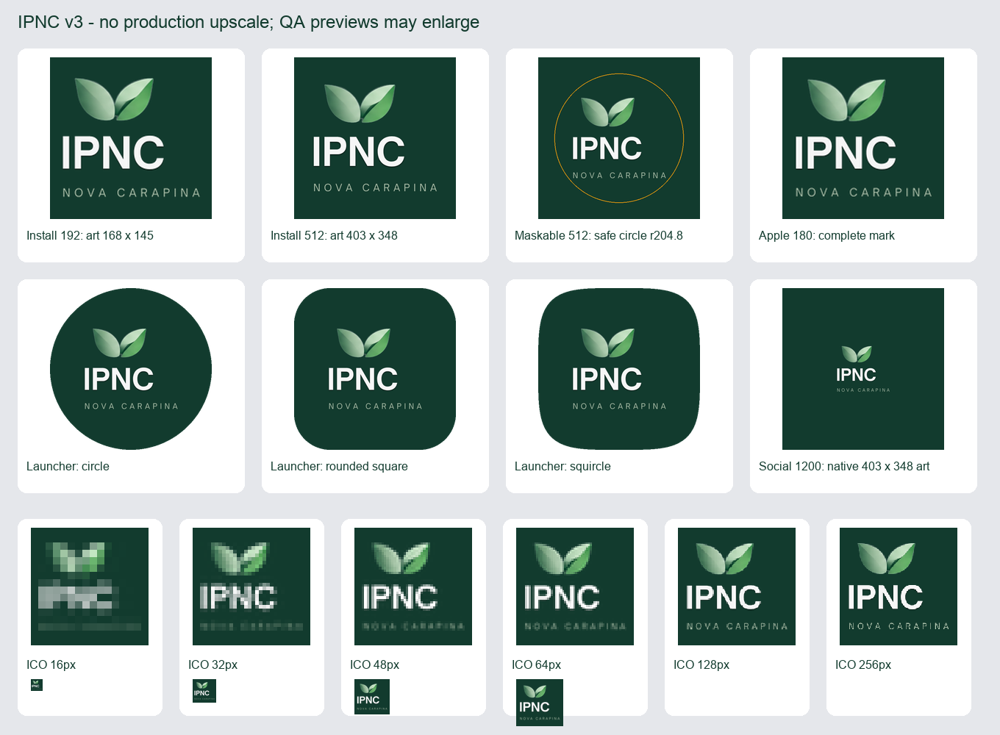

# Marca Canva IPNC — assets v3, 05/10/2026

Esta entrega substitui os assets de runtime da entrega anterior registrada em `docs/branding/2026-10-05/README.md`. A fonte vigente é a marca transparente escolhida pelo proprietário: duas folhas verdes, IPNC branco e NOVA CARAPINA em verde claro. O registro anterior e suas evidências permanecem como histórico da arte anterior.

## Fonte e fidelidade

O export Canva de 540 × 562 px está preservado em `docs/design-audit/auth-composition-2026-10-05/entry-logo-canva-export.png`. Sua marca previamente extraída sem perda está em `src/assets/logo-ipnc-entry.png`: PNG RGBA, **403 × 348 px**, 51.524 bytes, SHA256 `37f7bd6da099b8e29d5433ac1c1aca313bfedfe7c49241adc9f5feb4f847d83b`.

A comparação RGBA confirmou que `logo-ipnc-entry.png` coincide pixel por pixel com o recorte `(35,137,438,485)` do export Canva, abrangendo todo o conteúdo alpha e uma margem transparente de 4 px. O recorte apenas remove espaço transparente externo; nenhuma parte da marca é removida.

`src/assets/logo-ipnc.png` agora é uma cópia **byte por byte** de `logo-ipnc-entry.png`, preservando o caminho central dos consumidores existentes. Nenhum desenho, recoloração, remoção de elemento, correção, recorte adicional ou aumento de resolução foi aplicado ao master. O SHA256 dos pixels RGBA é `29d8e4fba27f712ac0fbdba65243b4d5aa8d81592a22243a5b44827c4e4ab211`.

## Derivados públicos

Os derivados mantêm a arte completa e sua proporção. As versões menores são reduzidas diretamente da fonte com LANCZOS; os canvases maiores usam a marca em resolução nativa. O fundo adicional é **#123b2e**, composto com o alpha original. Todos os PNGs e os quadros PNG do ICO têm codificação sem perda.

| Arquivo | Canvas | Marca dentro do canvas |
|---|---|---|
| `public/icons/icon-192x192-v3.png` | 192 × 192 | 168 × 145, redução |
| `public/icons/icon-512x512-v3.png` | 512 × 512 | 403 × 348, nativa |
| `public/icons/icon-maskable-512x512-v3.png` | 512 × 512 | 304 × 262, redução |
| `public/icons/apple-touch-icon-v3.png` | 180 × 180 | 156 × 134, redução |
| `public/icons/favicon-32x32-v3.png` | 32 × 32 | 28 × 24, redução |
| `public/icons/ipnc-social-v3.png` | 1200 × 1200 | 403 × 348, nativa |
| `public/favicon.ico` | 16, 32, 48, 64, 128 e 256 px | marca completa em cada quadro, redução direta |

Nenhum favicon usa recorte do símbolo. Em 16/32 px, o texto menor tem legibilidade limitada pela resolução; todos os elementos permanecem na composição. A imagem social ocupa um canvas de 1200 px, mas a marca mantém seus 403 × 348 px para cumprir a exigência de não fazer upscale.

Os seis arquivos públicos v2 e as três cópias antigas sem versão foram removidos de `public/icons`; as referências de runtime apontam para v3. Nenhum arquivo histórico de documentação foi removido.

## Maskable e máscaras de launcher

A marca reduzida a 304 × 262 px começa em `(104,125)`. O bounding box de conteúdo alpha é `(107,126,407,386)`. Sua maior distância de canto até o centro `(256,256)` é **199,251 px**, menor que o raio seguro de **204,8 px** (40% de 512), com margem de **5,549 px**.

O script compara todos os pixels alpha de conteúdo antes e depois das máscaras círculo, retângulo arredondado e squircle. As três diferenças têm bounding box nulo: nenhum pixel de conteúdo é cortado. O arquivo maskable é distinto do ícone normal.



A folha acima é evidência visual: somente suas prévias ampliam ícones pequenos para inspeção, com zoom nearest nos favicons. Nenhum asset de produção recebe ampliação.

## Manifest, metadados e cache

`public/manifest.json` usa os três ícones v3, com fundo e tema verde #123b2e. `id`, `start_url`, `scope`, `display` e `orientation` permanecem `/`, `/`, `/`, `standalone` e `portrait-primary`.

`index.html` referencia Apple, favicon PNG, Open Graph e Twitter v3; o ICO e manifest recebem `?v=ipnc-v3`. As dimensões sociais continuam 1200 × 1200. `public/sw.js` faz precache exclusivamente dos três ícones de instalação v3. Worker e registrador usam `ump-cache-v11`, e o registro aponta para `/sw.js?v=2026-10-05-logo-v3`.

A ativação remove somente caches antigos da aplicação. APIs, autenticação, OAuth, navegação e outras origens mantêm as exclusões existentes. O registrador continua seu fluxo existente de aviso/aplicação de atualização. Imports internos recebem o hash de conteúdo do build Vite. Launchers e prévias sociais também dependem dos caches do próprio cliente.

## Reprodução e verificação

```sh
python3 scripts/generate-brand-assets-v3.py \
  --source src/assets/logo-ipnc-entry.png \
  --output /tmp/ipnc-brand-assets-v3-reproduction
node --experimental-strip-types --test tests/pwa-install.test.mjs
git diff --check
```

Requer Python 3 com Pillow. O script escreve apenas no diretório de saída, produz a cópia exata do master, os derivados, os metadados e a folha de QA. Os quadros do ICO são comparados pixel por pixel e o quadro 32 px coincide com o favicon PNG 32 px.

O teste PWA passou **12/12**, incluindo dimensões reais dos PNGs, identidade do manifest, precache v3, composição maskable distinta, limpeza seletiva dos caches e exclusões de autenticação/navegação. `git diff --check` passou. O relatório JSON complementa a verificação de hashes e arquivos ativos: [verificação](asset-verification-v3.json) e [metadados](asset-metadata-v3.json).

## Integração no aplicativo

Fonte Canva: [IPNC — Marca da entrada com fundo transparente](https://www.canva.com/d/u1hp0HHGwUUyRqF), design `DAHXLtaTfl4`. O master de 403 × 348 é adequado aos tamanhos usados no aplicativo. Não é apresentado como master vetorial ou de alta resolução para impressão.

Consumidores encontrados e revisados:

- Entrada `Auth` e seleção `SocietySelector`.
- `PWAInstallPrompt`.
- `AppSidebar`, `MobileHeader` e `TabletNavigationRail`.
- `MembroLayout`.
- `PastorLayout`, `PastorSidebar`, `PastorMobileHeader` e `PastorSociedade`.
- `SecretariaNavigation`.
- `TreasuryDashboard`.
- `PortalIgreja` (identificação, confirmação, boas-vindas e navegação).
- `ResetPassword` e `EleicaoApresentar`.
- `generateCalendarPDF` e `generateEbdPDF` (chamada, período e trimestre).
- Manifest, service worker, favicon/Apple icon e metadados Open Graph/Twitter.

Containers claros das marcas receberam fundo verde #123b2e; a imagem continua transparente, inteira e proporcional por object-contain. Containers já escuros foram preservados. O helper `drawPdfBrandLogo` usa as dimensões reais da imagem para encaixá-la na moldura verde, sem alterar dados, totais, guardas ou paginação.

Quatro PDFs reais, oito páginas e somente dados fictícios foram gerados. Os pixels RGBA incorporados coincidem exatamente com o master; proporção, base verde, filtros de cancelamento, rodapés e três guardas de snapshot passaram. Evidências: [cabeçalhos](evidence/four-brand-headers.png), [oito páginas](evidence/all-eight-pages.png), [geração](evidence/generation.json), [inspeção](evidence/inspection.json).

Navegador: cabeçalhos mobile, rail e sidebar em 320, 390, 768, 1024 e 1440 px; área pastoral nas mesmas larguras; Secretaria 768/1440; tesouraria 390/1440; portal na confirmação de retorno e instalação em 375. Logos carregados com dimensões 403 × 348, object-contain, sem rolagem horizontal nos cenários verificados. Capturas e medidas em `docs/design-audit/auth-composition-2026-10-05/evidence/*-logo-*`. Todas as sessões e dados da validação foram fictícios, em fixtures isoladas.

Verificação integrada: tipos, 224 testes (incluindo 12 PWA), produção e diff check aprovados. Lint pertinente não acrescenta erros: Auth mantém um any preexistente e Portal mantém nove, comparados com HEAD. Build conserva avisos preexistentes de Browserslist, import de sonner e chunks >500 kB.

A busca global em src/public/index encontrou somente os dois masters transparentes idênticos e derivados v3 ativos. Ícones de sociedades são artes separadas enviadas pelo proprietário. A fotografia de fundo é decorativa e não contém a logo institucional antiga. Arquivos de documentação anteriores são históricos.

Nenhuma tela ativa encontrada continua utilizando a logo antiga.

A confirmação de commit, sincronização de main e deploy do Site existente é informada após o status nativo do Sites na entrega.
