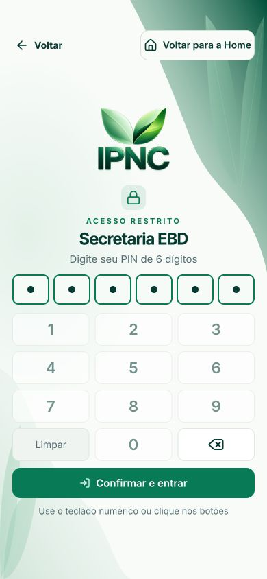
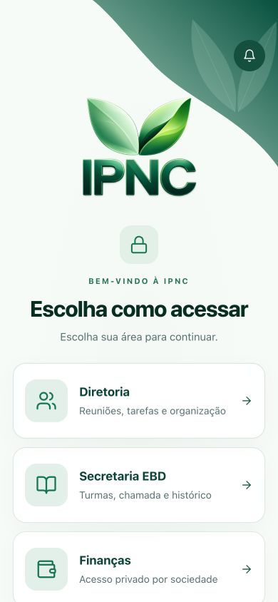
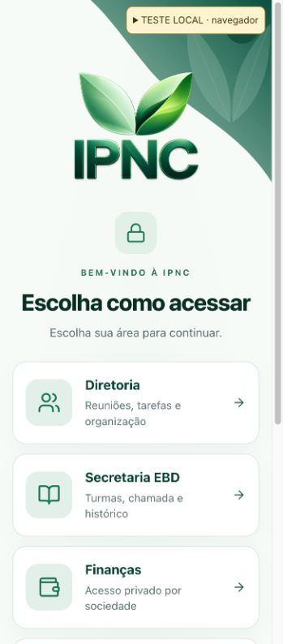
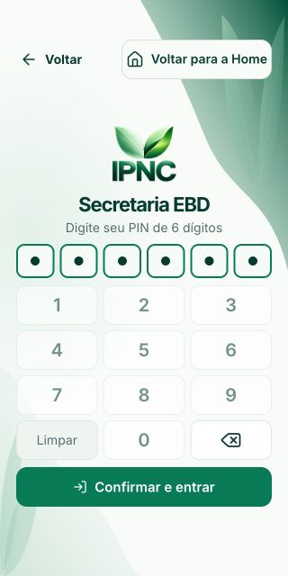

# PIN, Voltar e abertura na Home — 07/10/2026

O PIN de renovação da EBD podia ser fechado pelo botão Voltar, Escape ou histórico do celular, revelando a Secretaria com acesso expirado. A abertura comum do site também podia restaurar uma etapa da Diretoria ou redirecionar automaticamente para a EBD.

O cancelamento da renovação agora abandona os metadados locais de acesso e a trilha EBD antes de retornar a `/auth?home=1`. PINs iniciais voltam à seleção pública anterior. O componente compartilhado intercepta Back nativo antes do Router e da trilha privada; pedidos em andamento impedem cancelamento inclusive na janela anterior à renderização de `loading`. Nenhum cleanup agenda uma navegação posterior à Home.

Uma renovação bem-sucedida mantém o formulário montado e restaura o foco. Quando a trilha EBD já existe, o PIN marca sua entrada atual sem inserir uma duplicata: Back volta um nível e um destino Forward anterior continua disponível. No primeiro acesso, sem essa trilha, permanece a proteção com entrada própria.

Novos documentos do site e PWA começam na Home antes de montar telas privadas, inclusive com sessão salva recente. Reload/F5 e links comuns abertos em outro documento também iniciam na Home. Recuperação de conta, votação e apresentação pública preservam seus destinos específicos. Navegação interna SPA permanece normal. As regras existentes de retomada e a exceção para seletor nativo de arquivos foram preservadas.

## Validação

| Superfície | Cobertura com dados fictícios | Resultado |
| --- | --- | --- |
| Diretoria: SAF, UCP, UMP, UPA, UPH e Pastor | Voltar visível e histórico nativo; PIN parcial/completo não enviado; erro e nova montagem; Back repetido durante validação | A seleção pública reaparece, sem abrir área privada |
| EBD: administrador e professor, PIN inicial | Voltar visível/nativo; erro; validação pendente | Perfis públicos reaparecem após cancelamento |
| EBD: renovação | Voltar visível/nativo, Escape; acesso inicialmente expirado; repetição durante validação lenta | Home; metadados e trilha local removidos; nenhum conteúdo privado exposto antes de validar |
| EBD: renovação correta | Campo visitante preenchido sem salvar; foco; Back por nível; Forward anterior | Rascunho/foco preservados e nenhuma etapa duplicada |
| Tesouraria: seleção de sociedades | Voltar visível/nativo com PIN parcial/completo; erro e nova montagem | Seleção reaparece |
| Abertura de site/PWA | Documento novo com rota privada e estado recente; reload após escolher Diretoria; testes das exceções | Home pública, sem PIN da Diretoria restaurado |

QA independente: **40 cenários aprovados** no Chrome com histórico/popstate reais e backend fictício. Capturas e resultados detalhados: [browser-qa.json](browser-qa.json), [renovação, rascunho e histórico](renewal-draft-history.json), [Forward preservado](renewal-forward.json), [validação pendente do professor](renewal-pending-professor.json).

Viewports: 320×640, 375×740, 390×844, 768×1024, 1024×768 e 1440×900, com safe areas simuladas. Todos os controles PIN ficam visíveis e têm alvo mínimo de 44px. Em 768×1024 foram medidos 4px de rolagem decorativa; nenhum controle fica fora da área segura. O CSS não foi alterado nesta correção.

Verificações na fonte final:

- `npx tsc -p tsconfig.app.json --noEmit`: passou.
- `node --experimental-strip-types --test tests/*.mjs tests/*.ts`: **439/439 passaram**, sem testes ignorados.
- `npm run build`: passou; avisos já existentes de chunk acima de 500kB e import dinâmico de `sonner` que não separa o módulo.
- `git diff --check`: passou.
- ESLint nos arquivos alterados: os mesmos **13 erros preexistentes** `@typescript-eslint/no-explicit-any` em `Secretaria.tsx`, comparados com a base `1c563b4`; nenhum erro ou aviso adicional.

PWA: cache `ump-cache-v25` e registro `/sw.js?v=2026-10-07-pin-back-home-v17` para distribuir a correção. Logo oficial, assets, validação de PIN no servidor, banco e permissões não foram alterados.

## Evidências visuais

PIN antes do Back:

Home depois de cancelar a renovação pelo histórico nativo:

Abertura comum do navegador com rota privada anterior e estado recente:

PIN completo em celular pequeno:

## Limites

Nenhum gesto em aparelho Android/iOS físico nem instalação física do PWA foi executado. Back foi acionado pelo histórico real do navegador, com viewport móvel. A Tesouraria fictícia responde imediatamente, por isso sua validação pendente não foi exercitada no navegador; a proteção síncrona está coberta por testes automatizados. Forward durante um PIN ativo continua sendo tratado como uma saída pelo `popstate`; Forward após renovar corretamente foi conferido.

As chamadas e escritas reais em Supabase foram bloqueadas no ambiente isolado. Não houve lançamento financeiro, alteração de chamada, mensagem enviada nem mudança de dados reais para testar esta entrega.
