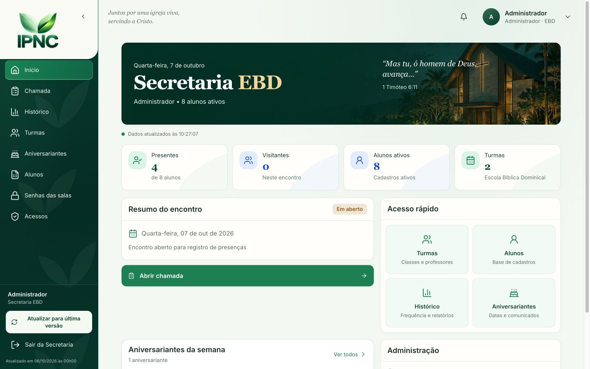
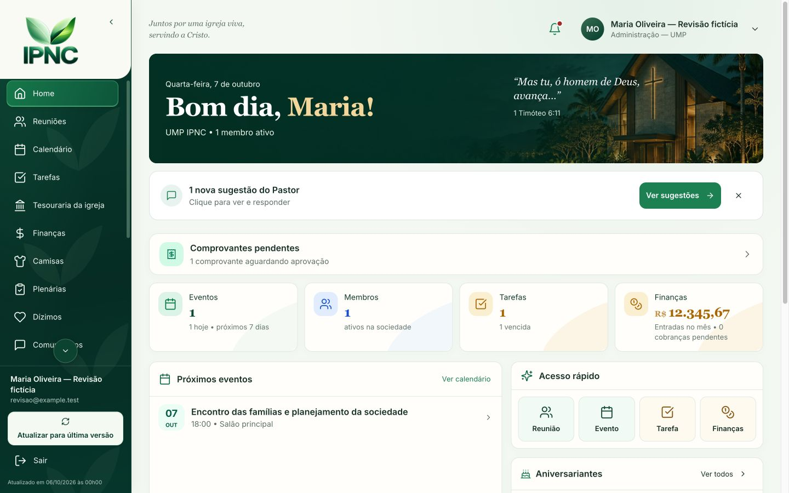
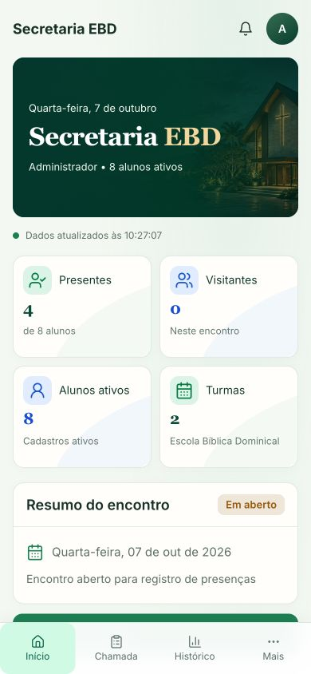
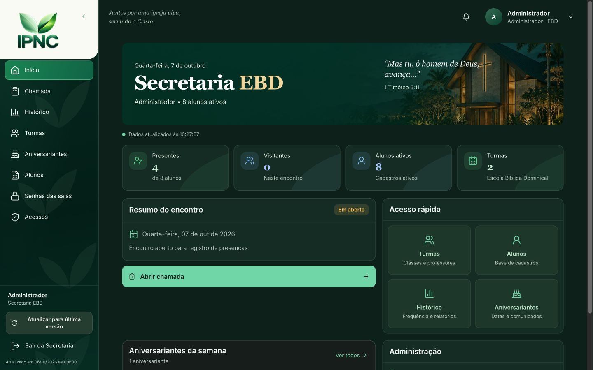
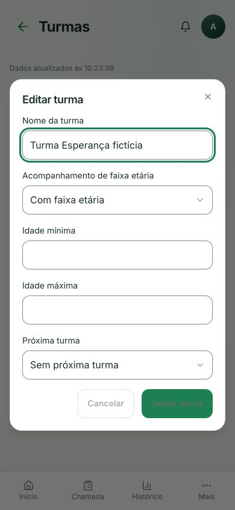
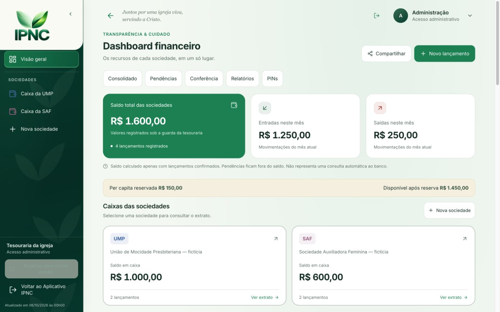

# Padronização das áreas IPNC — 07/10/2026

A Secretaria EBD passa a usar a composição da Diretoria: logo oficial na área clara do menu, menu verde com folhas discretas, cabeçalho de conta, painel de boas-vindas com a igreja, indicadores e painéis de ações. A mesma linguagem foi aplicada às páginas internas da Diretoria, área pastoral, Tesouraria e Portal da igreja.

## Implementação

- `WorkspaceHeader`, `WorkspaceNavigation` e `DashboardWelcome` centralizam a apresentação. Os módulos continuam fornecendo seus destinos, perfis e ações autorizadas.
- Menu lateral de 240 px no computador, trilho de 76 px no tablet e navegação inferior no celular. A Secretaria mantém seus filtros de professor/administrador e o rodapé da chamada acompanha o menu recolhido.
- Cards, campos, botões, menus, títulos, foco e diálogos usam os mesmos tokens de cor, tipografia, espaçamento e bordas nos temas claro/escuro. Card/AppCard expõem classes semânticas, preservando `p-0`, `noPadding` e faixa de cor.
- Diretoria e Pastor usam um único cabeçalho também no celular. Foram preservados voltar, gesto de retorno, confirmação de saída, instalação e atualização do PWA. A notificação duplicada no painel de boas-vindas foi removida.
- A planilha de alunos e a conclusão de tarefas têm alvos de toque de 44 px com o desenho interno do checkbox preservado. O cancelamento da edição de nascimento recebeu nome acessível.
- Cache PWA atualizado para v27. A logo e os arquivos de instalação permanecem os oficiais; a otimização anterior dos ícones de sociedades foi preservada.

## Verificação

- Node 24 / npm com o `package-lock.json` existente.
- `npx tsc -p tsconfig.app.json --noEmit`: aprovado.
- `node --experimental-strip-types --test tests/*.mjs tests/*.ts`: **458 testes aprovados**.
- `npm run build`: aprovado. Permanecem os avisos anteriores de tamanho de bundle e importação dinâmica/estática do refresh-site.
- Lint dos componentes novos e arquivos de composição sem falhas. Os arquivos Portal, Secretaria, PlanilhaAlunos e Turmas mantêm respectivamente 9, 13, 2 e 4 erros antigos de `no-explicit-any`; regras e mensagens foram comparadas com o HEAD anterior, sem novos erros. A dívida global anterior (274 erros / 55 avisos) não foi apresentada como resolvida. Comparação em [lint-baseline.json](lint-baseline.json).
- Testes de navegação preservam perfis, destinos, dados ainda indisponíveis, consulta/retry de sociedades, árvore única de conteúdo e limpeza do tema compartilhado em shells aninhados.

## Cobertura e limites

A conferência usa o servidor isolado `tests/vite.system-theme.config.ts`, com identidades e dados fictícios. O CSP e os transportes da fixture bloqueiam o Supabase e o service worker reais. Nenhum lançamento, presença, voto, mensagem ou configuração foi gravado em produção.

A matriz reúne **400 combinações**, nas larguras de 375, 390, 768, 1024 e 1440 px, nos dois temas, sem overflow horizontal ou erro de renderização na conferência final. Foram conferidas as oito áreas administrativas da EBD; início, chamada e lista de alunos do professor; as páginas principais da Diretoria; cinco áreas pastorais; resumo e extrato da Tesouraria; e as quatro seções do Portal. Menus, seleção local de alunos e formulários representativos foram abertos e cancelados sem salvar. Revalidações posteriores às correções estão identificadas nos registros de QA.

[Resumo da QA](qa-summary.md), [matriz de telas](matrix.json), [formulários](modal-matrix.json), [revalidação dos alvos de alunos](target-retests.json), [revalidação dos alvos de tarefas](task-target-retests.json) e [PIN EBD](pin-smoke.json) registram os resultados. A matriz inicial preserva os problemas encontrados; as revalidações registram as correções.

[Inventário de rotas](route-inventory.json) registra quais páginas herdam cada shell. Formulários de recuperação, acesso público ao voto e apresentação de eleição mantêm seus fluxos próprios. A padronização não altera consultas, cálculos, regras de autenticação/PIN ou permissões. Não houve validação manual de sessões protegidas reais nem de instalação em aparelho físico; esses limites não são substituídos pelas capturas de browser ou pelos testes.

## Capturas com dados fictícios

## Publicação

Site existente: https://renovo-ipnc.octavioribeiroleite.chatgpt.site. Projeto `appgprj_6a9808f7510c819190f1e078cac5fb8c`, público atual preservado. A entrega é confirmada pelo status nativo do Sites e pela revisão informada na resposta final; prévia e build locais não constituem publicação.
